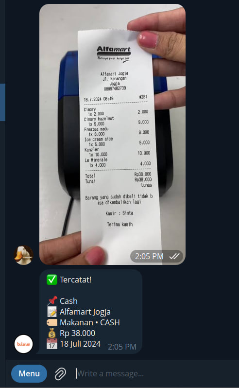

# CatatAja

Bot Telegram pencatat pengeluaran tanpa server. Ketik transaksi pakai bahasa sehari-hari, bot memahaminya dengan Gemini AI lalu menyimpannya ke Google Sheets.

Jalan sepenuhnya di Google Apps Script — tanpa server, tanpa biaya hosting, tanpa instalasi dependency apa pun.

Baca dalam bahasa lain: **[English (README_EN.md)](README_EN.md)**

---

## Cara kerja

Kamu kirim pesan biasa, atau foto struk/bukti bayar:

```
beli kopi 25k
```

Bot membalas (pesan yang sama di-edit, tanpa spam pesan baru):

```
✅ Tercatat!

📌 Transfer
📝 beli kopi
🏷 Makanan • JAGO
💰 Rp 25.000
📅 17 Juli 2026
```

Baris tersebut masuk ke tab "Expenses" di Google Sheets kamu.




---

## Tampilan

Dashboard dan sheet di Google Sheets:


## Contoh

| Kamu ketik | Metode | Bank | Kategori | Nilai |
|------------|--------|------|----------|-------|
| `beli kopi 25k` | Transfer | JAGO | Makanan | 25.000 |
| `bayar shopee 120k` | Transfer | JAGO | Belanja | 120.000 |
| `makan siang 15k tunai` | Cash | CASH | Makanan | 15.000 |
| `jual server 150k` | Transfer | JAGO | server | 150.000 |
| `beli groceries 120rb BCA kemarin` | Transfer | BCA | Belanja | 120.000 |

## Kirim gambar / struk

Selain mengetik, kamu bisa **mengirim foto** struk, invoice, bukti transfer, atau screenshot pembayaran e-wallet/QRIS. Bot membaca gambar pakai Gemini Vision lalu mencatat otomatis seperti pesan teks.

| Kamu kirim | Hasil |
|------------|-------|
| Foto struk kopi Rp25.000 | Transfer • Makanan • JAGO • 25.000 |
| Screenshot transfer BCA Rp120.000 | Transfer • Belanja • BCA • 120.000 |
| Foto + caption `tunai` | Cash • CASH • (kategori sesuai gambar) |

**Tips:**
- Tambahkan **caption** opsional untuk memperjelas, misalnya foto struk dengan caption `makan siang`.
- Gambar dapat dikirim sebagai foto maupun file dokumen (selama bertipe image).
- Jika gambar tidak terbaca, bot akan meminta Anda mengetik data secara manual.

**Catatan:** Telegram membatasi unduhan file bot hingga 20 MB. Struk atau screenshot biasanya jauh di bawah batasan tersebut.

---

## Setup

### 1. Buat bot Telegram

Buka [@BotFather](https://t.me/botfather), kirim `/newbot`, ikuti instruksi. Simpan bot token.

### 2. Dapatkan Chat ID

Buka [@userinfobot](https://t.me/userinfobot), kirim pesan apa saja. Bot akan membalas dengan Chat ID berupa angka.

### 3. Dapatkan Gemini API Key

Kunjungi https://aistudio.google.com/apikey dan buat API key gratis.

### 4. Salin spreadsheet template

Buka [spreadsheet template](https://docs.google.com/spreadsheets/d/1LZJjOE-YZL2GDH4JXVhxa0sQqH1vF3m_QxufEPNQrNc/edit?usp=sharing), lalu pilih **File > Make a copy** untuk menyalinnya ke Google Drive Anda.

### 5. Buka Apps Script

Di spreadsheet yang sudah disalin, klik **Extensions > Apps Script**.

### 6. Masukkan kode

- Ganti isi `Code.gs` default dengan isi `Kode.gs` dari repository ini.
- Buat file kedua bernama `webhook`, lalu paste isi `webhook.gs` ke file tersebut.
- Isi konfigurasi di bagian atas `Kode.gs`:

```javascript
var BOT_TOKEN = "bot_token_kamu";
var USERS = [chat_id_kamu];
var GEMINI_API_KEY = "gemini_key_kamu";
```

### 7. Deploy sebagai web app

- Pilih **Deploy > New deployment > Web app**
- Execute as: Me
- Who has access: Anyone
- Klik Deploy dan berikan otorisasi saat diminta
- Salin Web App URL

### 8. Daftarkan webhook

Di file `webhook.gs`, isi token dan Web App URL:

```javascript
var token = "bot_token_kamu";
var url = "webapp_url_kamu";
```

Pilih function `setWebhook` dan klik **Run**. Periksa execution log — harus menampilkan `"ok":true`.

### 9. Tes

Buka bot Anda di Telegram, kirim `/start`, lalu coba:

```
beli kopi 25k
```

---

## Konfigurasi

Edit bagian atas `Kode.gs` untuk mengatur daftar bank dan kategori:

```javascript
var BANKS = ["JAGO", "BCA", "CASH"];
var KATEGORI = ["Belanja", "Cicilan", "Makanan", "Tabungan", "Hiburan", "server"];
```

**Penting:** Nilai-nilai ini harus cocok dengan data validation (dropdown) di Google Sheets pada kolom D, F, dan G. Jika tidak cocok, sheet akan menolak penulisan data.

---

## Struktur spreadsheet

| Kolom | Field | Validasi |
|-------|-------|----------|
| A | Cek (checkbox) | — |
| B | Tanggal | — |
| C | Bulan | — |
| D | Transaksi | Transfer / Cash |
| E | Uraian | — |
| F | Kategori | dropdown |
| G | Bank | dropdown |
| H | Nilai | angka |

---

## Troubleshooting

Jalankan function berikut dari editor Apps Script untuk mendiagnosis masalah:

| Function | Cek apa |
|----------|---------|
| `testGeminiConnection` | Apakah API key valid dan model mana yang merespon |
| `listGeminiModels` | Daftar semua model yang dapat diakses dengan API key Anda |
| `testAddToSheet` | Apakah data dapat ditulis ke sheet tanpa error |

**Masalah umum:**

- **AI gagal merespon** — API key kosong atau tidak valid. Jalankan `testGeminiConnection`.
- **Validation error** — Output AI tidak sesuai dengan dropdown di sheet. Jalankan `testAddToSheet`.
- **Bot tidak merespon** — URL webhook salah. Jalankan ulang `setWebhook` dengan URL yang benar.
- **429 quota exceeded** — Limit free tier Gemini telah tercapai. Reset dilakukan setiap hari, atau aktifkan billing.
- **404 model not found** — Nama model sudah deprecated. Jalankan `listGeminiModels` untuk mengetahui nama model terbaru.

---

## Input manual

Jika AI tidak tersedia, Anda tetap dapat menambah data dengan format semicolon:

```
/tambahdata Transfer;makan;Makanan;JAGO;25000
```

---

## Apple Shortcut: Foto langsung ke sheet

Untuk kemudahan, Anda dapat menggunakan Apple Shortcut agar foto dapat dikirim langsung ke Google Sheets tanpa perlu mengetik teks di Telegram.

**Mengapa tidak gunakan endpoint Telegram `sendPhoto`?**  
Foto yang dikirim melalui bot tidak masuk kembali ke webhook, sehingga tidak akan tercatat otomatis ke sheet. Oleh karena itu, gunakan endpoint Apps Script untuk memastikan foto diproses melalui alur Gemini Vision yang sama.

### Langkah-langkah setup

**Persiapan:**
Tambahkan file `shortcut.gs` ke project Apps Script yang sama dengan `Kode.gs`.

**STEP 1: Ambil Foto**
- Buka Shortcuts app → tekan `+` → cari **Take Photo** → Add

**STEP 2: Enkripsi Base64**
- Cari **Base64 Encode** → Add

**STEP 3: Buat Dictionary**
- Cari **Dictionary** → Add
- Field 1: `chat_id` = `123456789` (ganti dengan Chat ID Anda)
- Field 2: `photo` = hasil **Base64 Encode**

**STEP 4: Kirim ke API**
- Cari **Get Contents of URL** → Add
- URL: `https://YOUR_API_ENDPOINT` (ganti dengan Web App URL Anda)
- Method: `POST`
- Headers: `Content-Type: application/json`
- Body: Dictionary dari step 3

**STEP 5: Tampilkan Hasil**
- Cari **Show Result** → Add

Selesai! Bot akan mengirim konfirmasi ke Telegram setelah transaksi berhasil masuk ke sheet.

**Keamanan:** Jangan masukkan bot token di dalam Shortcut. Token tetap disimpan secara aman hanya di `Kode.gs`.

### Pengaturan default
- Metode default: **Transfer**
- Bank default: **JAGO**
- Untuk menggunakan Cash: sebut "tunai" atau "cash" di caption
- Untuk ganti bank: sebut nama bank lain (contoh: "BCA", "MANDIRI")

### Tips penggunaan
- Bot memahami singkatan nominal: `rb`, `ribu`, `k` = ribu; `jt`, `juta` = juta
- Bot juga memahami tanggal relatif: `kemarin`, `2 hari lalu`, `tgl 13`, `minggu lalu`

---

## Lisensi

MIT
