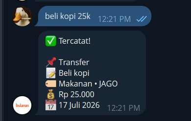
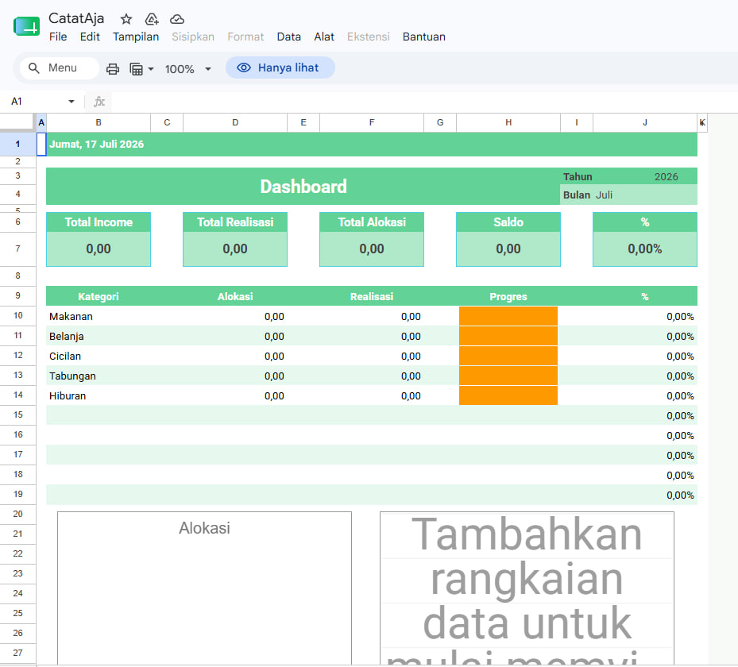
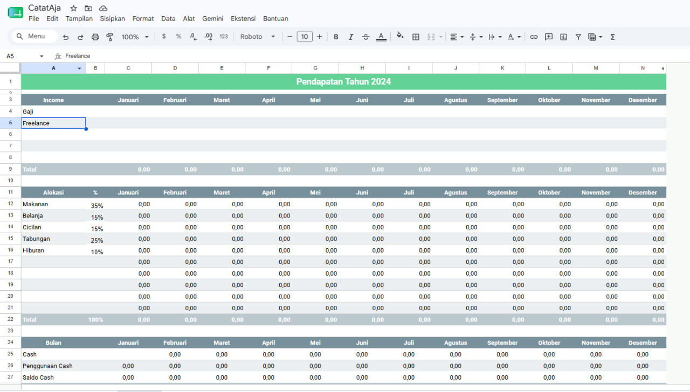

# CatatAja

Read in another language: **[Bahasa Indonesia (README.md)](README.md)**

Serverless expense tracker for Telegram. Type transactions in plain Indonesian, the bot parses them with Gemini AI and writes them to a Google Sheet.

Runs entirely on Google Apps Script — no server, no hosting cost, no dependencies to install.

---

## How it works

You send a normal message, or a photo of a receipt/proof of payment:

```
beli kopi 25k
```

The bot replies (edits the same message, no spam):

```
✅ Tercatat!

📌 Transfer
📝 beli kopi
🏷 Makanan • JAGO
💰 Rp 25.000
📅 17 Juli 2026
```

The row lands in your Google Sheet's "Expenses" tab.



---

## Screenshots

Dashboard and sheets in Google Sheets:





## Examples

| You type | Method | Bank | Category | Amount |
|----------|--------|------|----------|--------|
| `beli kopi 25k` | Transfer | JAGO | Makanan | 25.000 |
| `bayar shopee 120k` | Transfer | JAGO | Belanja | 120.000 |
| `makan siang 15k tunai` | Cash | CASH | Makanan | 15.000 |
| `jual server 150k` | Transfer | JAGO | server | 150.000 |
| `beli groceries 120rb BCA kemarin` | Transfer | BCA | Belanja | 120.000 |

## Send an image / receipt

Besides typing, you can **send a photo** of a receipt, invoice, transfer proof, or an e-wallet/QRIS payment screenshot. The bot reads the image with Gemini Vision and logs it automatically, just like a text message.

| You send | Result |
|----------|--------|
| Photo of a coffee receipt Rp25.000 | Transfer • Makanan • JAGO • 25.000 |
| BCA transfer screenshot Rp120.000 | Transfer • Belanja • BCA • 120.000 |
| Photo + caption `tunai` | Cash • CASH • (category from image) |

Tips:
- Add an optional **caption** to clarify, e.g. receipt photo + caption `makan siang`.
- Images sent as a photo or as a file/document are both supported (as long as the type is an image).
- If the image can't be read, the bot will ask you to type it manually.

Note: Telegram limits bot file downloads to 20 MB. Receipts/screenshots are usually well under that.

## Apple Shortcut: photo straight to the sheet

Do not use Telegram's `sendPhoto` endpoint: a photo sent by a bot does not return to that bot's webhook, so it cannot be recorded. Use this Apps Script endpoint to process the photo through the same Gemini Vision workflow instead.

1. Add `shortcut.gs` from this repository to the same Apps Script project as `Kode.gs`.
2. In `shortcut.gs`, replace `SHORTCUT_TOKEN` with a long random string. Do not put the bot token in the Shortcut.
3. In Apple Shortcuts, create: **Take Photo** (or **Select Photos**) -> **Base64 Encode** -> **Get Contents of URL**.
4. Configure **Get Contents of URL**:
   - URL: your Apps Script Web App URL
   - Method: `POST`
   - Request Body: `JSON`
   - Dictionary:

```json
{
  "chat_id": 123456789,
  "shortcut_token": "your_SHORTCUT_TOKEN",
  "image_base64": "Base64 Encode output",
  "mime_type": "image/jpeg"
}
```

Use `image/png` if the Shortcut sends PNG. The bot sends a Telegram confirmation after the transaction reaches the sheet.

Default method is Transfer, default bank is JAGO. Say "tunai" or "cash" to switch to Cash. Name a bank to override JAGO.

The bot understands amount shorthand: `rb`/`ribu`/`k` = thousand, `jt`/`juta` = million. It also parses relative dates: `kemarin`, `2 hari lalu`, `tgl 13`, `minggu lalu`.

---

## Setup

### 1. Create a Telegram bot

Open [@BotFather](https://t.me/botfather), send `/newbot`, follow the prompts. Save the bot token.

### 2. Get your Chat ID

Open [@userinfobot](https://t.me/userinfobot) and send any message. It replies with your numeric Chat ID.

### 3. Get a Gemini API key

Go to https://aistudio.google.com/apikey and create a free key.

### 4. Copy the spreadsheet template

Open the [template sheet](https://docs.google.com/spreadsheets/d/1LZJjOE-YZL2GDH4JXVhxa0sQqH1vF3m_QxufEPNQrNc/edit?usp=sharing), then **File > Make a copy** to your own Drive.

### 5. Open Apps Script

In your copied spreadsheet, click **Extensions > Apps Script**.

### 6. Add the code

- Replace the default `Code.gs` content with `Kode.gs` from this repo.
- Create a second file named `webhook` and paste `webhook.gs` into it.
- Fill in the config at the top of `Kode.gs`:

```javascript
var BOT_TOKEN = "your_bot_token";
var USERS = [your_chat_id];
var GEMINI_API_KEY = "your_gemini_key";
```

### 7. Deploy as a web app

- **Deploy > New deployment > Web app**
- Execute as: Me
- Who has access: Anyone
- Deploy and authorize when prompted
- Copy the Web App URL

### 8. Register the webhook

In `webhook.gs`, fill in your token and the Web App URL:

```javascript
var token = "your_bot_token";
var url = "your_webapp_url";
```

Select the `setWebhook` function and click Run. Check the execution log — it should return `"ok":true`.

### 9. Test

Open your bot in Telegram, send `/start`, then try:

```
beli kopi 25k
```

---

## Configuration

Edit the top of `Kode.gs`:

```javascript
var BANKS = ["JAGO", "BCA", "CASH"];
var KATEGORI = ["Belanja", "Cicilan", "Makanan", "Tabungan", "Hiburan", "server"];
```

These must match the data validation (dropdowns) in your Google Sheet columns D, F, and G. If they don't match, the sheet rejects the write.

---

## Spreadsheet structure

| Column | Field | Validation |
|--------|-------|------------|
| A | Cek (checkbox) | — |
| B | Tanggal | — |
| C | Bulan | — |
| D | Transaksi | Transfer / Cash |
| E | Uraian | — |
| F | Kategori | dropdown |
| G | Bank | dropdown |
| H | Nilai | number |

---

## Troubleshooting

Run these functions from the Apps Script editor to diagnose problems:

| Function | What it checks |
|----------|----------------|
| `testGeminiConnection` | Whether your API key works and which models respond |
| `listGeminiModels` | Lists every model your key can access |
| `testAddToSheet` | Whether data can be written to the sheet without errors |

Common issues:

- **AI gagal merespon** — API key missing or invalid. Run `testGeminiConnection`.
- **Validation error** — AI output doesn't match a sheet dropdown. Run `testAddToSheet`.
- **Bot not responding** — Webhook URL is wrong. Re-run `setWebhook` with the correct URL.
- **429 quota exceeded** — Free-tier Gemini limit hit. Resets daily, or enable billing.
- **404 model not found** — Model name deprecated. Run `listGeminiModels` to get current names.

---

## Manual input

If AI is unavailable, you can still add entries with the semicolon format:

```
/tambahdata Transfer;makan;Makanan;JAGO;25000
```

---

## License

MIT
